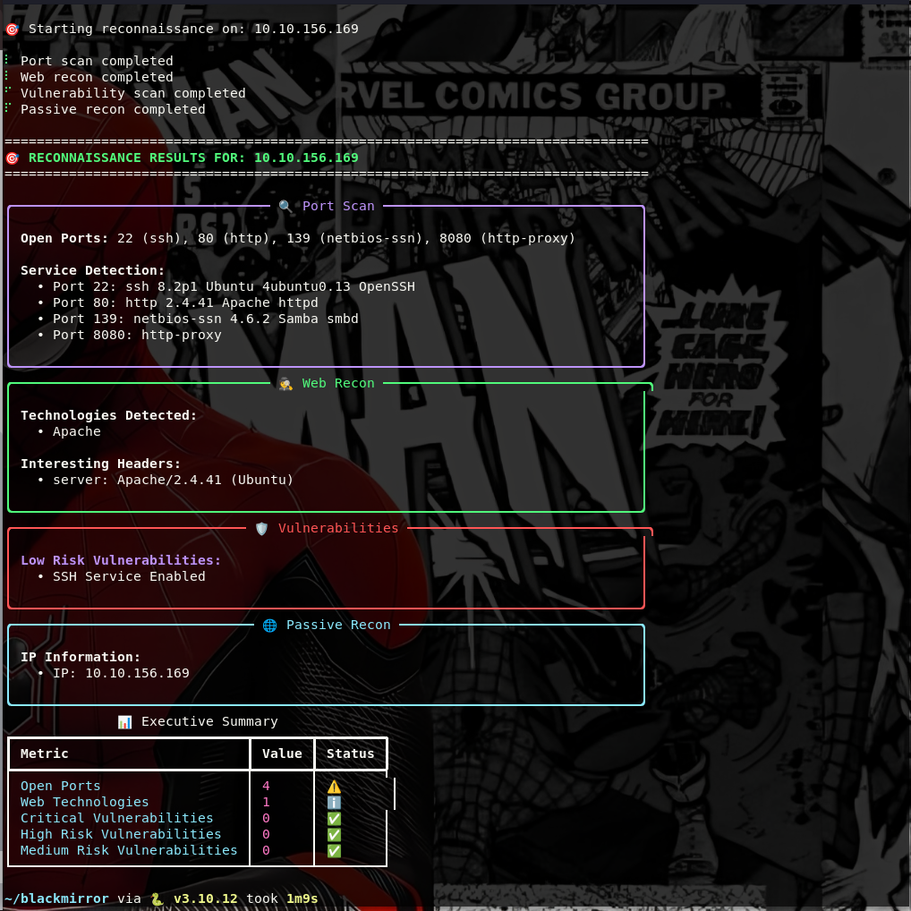

# 🔥 blackmirror

A powerful, modular, and hacker-centric reconnaissance tool that automates the entire scanning workflow for a given IP address or domain.

**Created by R Muhamme Thoufeel**

Built to eliminate the boring, repetitive parts of ethical hacking, bug bounties, CTFs, and red team ops — blackmirror gives you all the critical information in one terminal command.

## 🚀 Quick Start

### 1. Clone and Install

```bash
# Clone the repository
git clone https://github.com/yourusername/blackmirror.git
cd blackmirror

# Install dependencies
pip3 install -r requirements.txt

# Install nmap (required)
sudo apt install nmap
```

### 2. Start Scanning

```bash
# Basic scan
python3 blackmirror.py example.com

# Module-specific scans
python3 blackmirror.py example.com --ports --web --vulns

# Export report
python3 blackmirror.py example.com --export markdown
```

## 🎯 Features

### Core Capabilities
- **🔍 Port Scanning** - Fast port discovery with service detection
- **🕵️ Web Reconnaissance** - Technology fingerprinting and file discovery
- **🛡️ SSL/TLS Analysis** - Certificate inspection and cipher analysis
- **⚡ Vulnerability Scanning** - CVE detection and misconfiguration checks
- **🌐 Passive Reconnaissance** - DNS, WHOIS, and basic intelligence
- **📊 Beautiful Reporting** - CLI output + export to Markdown/HTML/JSON

### Key Advantages
- ✅ **No API keys required** - Works completely offline
- ✅ **Student-friendly** - Perfect for learning cybersecurity
- ✅ **Professional-grade output** - Beautiful terminal interface
- ✅ **Multiple export formats** - Markdown, HTML, JSON
- ✅ **Automation ready** - JSON output for scripting
- ✅ **Cross-platform** - Works on Linux, WSL, Windows, Mac

## 📋 Usage Examples

### Basic Reconnaissance
```bash
python3 blackmirror.py example.com
```

**Output:**
```
┌─[🔍 Port Scan]───────────────────────────────────────────┐
│ Open Ports: 22 (SSH), 80 (HTTP), 443 (HTTPS)            │
│ Service Fingerprint: Apache 2.4.29, Ubuntu, OpenSSH 8.2 │
└──────────────────────────────────────────────────────────┘

┌─[🕵️ Web Recon]──────────────────────────────────────────┐
│ Tech: Apache, PHP 7.4, Bootstrap, jQuery                │
│ Headers: X-Powered-By: PHP/7.4, Server: Apache          │
│ Interesting Files: robots.txt, .git/, backup.zip        │
└──────────────────────────────────────────────────────────┘

┌─[🛡️ Vulnerabilities]────────────────────────────────────┐
│ CVE-2021-41773 (Apache Path Traversal) – ⚠️ Patch now    │
│ CVE-2022-23307 (Log4j) – 🛡 Not detected                 │
└──────────────────────────────────────────────────────────┘
```

### Module-Specific Scans
```bash
# Port scanning only
python3 blackmirror.py example.com --ports

# Web reconnaissance only
python3 blackmirror.py example.com --web

# SSL analysis only
python3 blackmirror.py example.com --ssl

# Vulnerability scanning only
python3 blackmirror.py example.com --vulns

# Passive reconnaissance only
python3 blackmirror.py example.com --passive
```

### Report Export
```bash
# Export as Markdown
python3 blackmirror.py example.com --export markdown

# Export as HTML
python3 blackmirror.py example.com --export html

# Export as JSON
python3 blackmirror.py example.com --export json
```

### Automation Mode
```bash
# Silent mode for scripting
python3 blackmirror.py example.com --quiet --json

# Custom configuration
python3 blackmirror.py example.com --config custom-config.yaml
```

## 🧠 Module Details

### Port Scanner (`--ports`)
- Fast port scanning using nmap
- Service and version detection
- OS fingerprinting
- Custom port ranges

### Web Recon (`--web`)
- Technology fingerprinting (Apache, Nginx, PHP, WordPress, React, etc.)
- Header analysis
- File discovery (robots.txt, .htaccess, etc.)
- Form analysis
- Directory enumeration

### SSL Analyzer (`--ssl`)
- Certificate inspection
- Cipher analysis
- SSL/TLS vulnerability checks
- Protocol support detection

### Vulnerability Scanner (`--vulns`)
- Custom vulnerability checks
- Misconfiguration detection
- Default credential checks
- Information disclosure detection

### Passive Recon (`--passive`)
- DNS enumeration (A, MX, NS records)
- Basic geolocation
- IP information
- Network intelligence

## 📊 Output Formats

### CLI Output
Beautiful, colorized terminal output with progress indicators and organized sections.

### Markdown Reports
Comprehensive reports with:
- Executive summary
- Detailed findings
- Recommendations
- Technical details

### HTML Reports
Interactive web reports with:
- Styled sections
- Vulnerability categorization
- Clickable elements
- Exportable format

### JSON Output
Machine-readable output for:
- API integration
- Automation scripts
- Data processing
- Custom analysis

## 🔧 Dependencies

### Required Tools
- **Python 3.8+**
- **nmap** - Port scanning

### Python Dependencies
- requests - HTTP requests
- beautifulsoup4 - HTML parsing
- python-nmap - Nmap integration
- rich - Terminal formatting
- pyyaml - Configuration management
- dnspython - DNS queries

## 🛡️ Security Considerations

### Legal Usage
- Only scan targets you own or have explicit permission to test
- Respect rate limits and terms of service
- Follow responsible disclosure practices
- Comply with local laws and regulations

### Ethical Guidelines
- Use for educational and authorized security testing only
- Do not use for malicious purposes
- Respect privacy and data protection laws
- Report vulnerabilities responsibly

## 🧪 Testing

### Run Test Suite
```bash
python3 test_blackmirror.py
```

### View Demo
```bash
python3 demo.py
```

### Test with Real Targets
```bash
# Test with scanme.nmap.org (authorized for testing)
python3 blackmirror.py scanme.nmap.org

# Test with httpbin.org (public API)
python3 blackmirror.py httpbin.org
```

### 🔍 Scan Results Example




## 🤝 Contributing

We welcome contributions! Areas for contribution:

- **New Modules** - Add new scanning capabilities
- **Bug Fixes** - Improve reliability and accuracy
- **Documentation** - Enhance guides and examples
- **Testing** - Add comprehensive test coverage
- **Performance** - Optimize scanning speed

## 📞 Support

- **Issues**: GitHub Issues
- **Discussions**: GitHub Discussions
- **Documentation**: Wiki pages
- **Community**: Security community forums

## 📝 License

MIT License - see LICENSE file for details.

## 🙏 Acknowledgments

- **nmap** - For powerful port scanning capabilities
- **Rich** - For beautiful terminal output
- **Requests** - For HTTP functionality
- **BeautifulSoup** - For HTML parsing

---

**⚠️ Disclaimer**: This tool is for educational and authorized security testing purposes only. Users are responsible for ensuring they have proper authorization before scanning any targets.

**Created by R Muhamme Thoufeel**

*blackmirror - Because reconnaissance should be beautiful, not boring.* 
